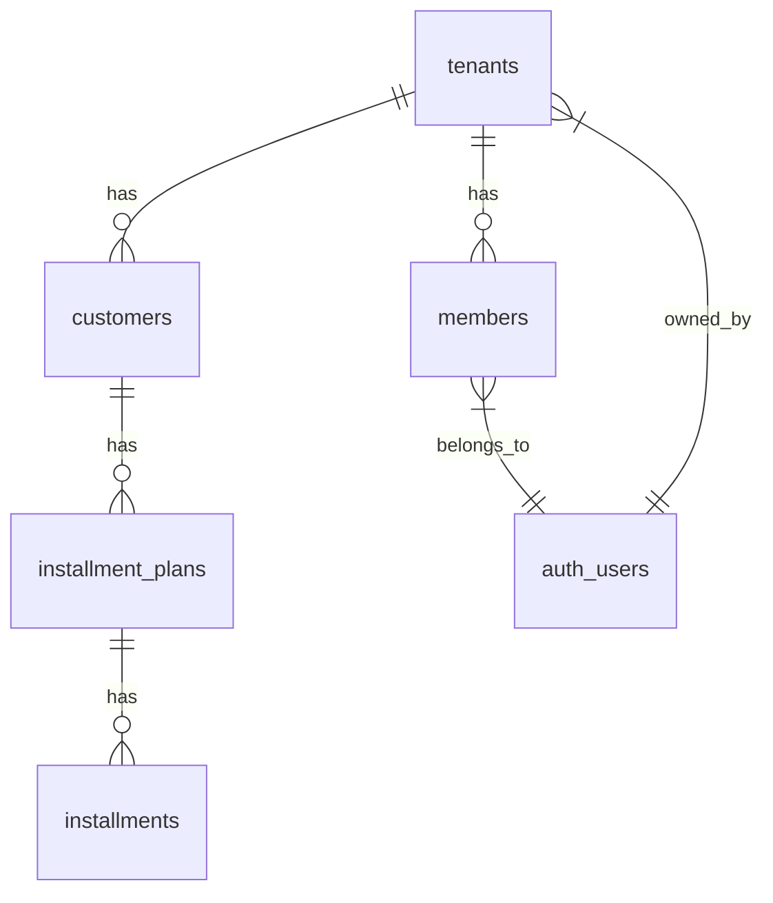

# Supabase Database Setup

This directory contains the database schema, migrations, and setup scripts for the Installment Management system.

## 🚨 **Infinite Recursion Fix Applied**

The infinite recursion error in RLS policies has been fixed. The issue was caused by circular dependencies between the `members` and `tenants` table policies.

### What was wrong:
- Members policies referenced the members table to check tenant membership
- Tenants policies referenced the members table to check tenant membership  
- This created an infinite loop when Postgres tried to evaluate the policies

### What was fixed:
- Replaced `EXISTS (SELECT ... FROM members m WHERE ...)` with `IN (SELECT tenant_id FROM members WHERE ...)`
- Removed circular dependencies by using simpler, direct lookups
- Updated all policies to be non-recursive

## ✨ **Auto-Onboarding Feature**

**NEW**: When a user signs up, the system automatically:
1. Creates a tenant (workspace) with a default name
2. Makes the user the OWNER of that tenant
3. Adds 4 sample customers so users can start exploring immediately

This eliminates the need for manual test data setup. Users get a fully functional workspace right after signup!

## 📁 **File Structure**

```
src/supabase/
├── models/           # Individual table schemas
│   ├── tenants.sql
│   ├── members.sql
│   ├── customers.sql
│   ├── installment_plans.sql
│   ├── installments.sql
│   └── activity_logs.sql
├── migrations/       # Database migration files
│   ├── 001_fix_rls_infinite_recursion.sql
│   ├── 002_setup_test_data.sql
│   ├── 003_auto_onboard_new_users.sql
│   └── 004_add_sample_customers_for_new_tenants.sql
├── setup_database.sql    # Complete setup script (INCLUDES AUTO-ONBOARDING)
├── init_test_data.sql    # Manual test data (LEGACY - not needed with auto-onboarding)
└── README.md            # This file
```

## 🛠️ **Setup Instructions**

### Option 1: Quick Setup with Auto-Onboarding (Recommended)
1. **Run the complete setup script** in your Supabase SQL Editor:
   ```sql
   -- Copy and paste the contents of setup_database.sql
   ```

2. **That's it!** New users will automatically get:
   - Their own tenant/workspace
   - Owner permissions
   - 4 sample customers to work with

### Option 2: Manual Migration
1. **Run migration 001** (fixes RLS infinite recursion)
2. **Run migration 003** (adds auto-onboarding)
3. **Run migration 004** (adds sample customers)
4. **Apply updated models** by running each file in `models/` directory

## 🔧 **Environment Setup**

Create `.env.local` in your project root:
```bash
NEXT_PUBLIC_SUPABASE_URL=your-supabase-project-url
NEXT_PUBLIC_SUPABASE_ANON_KEY=your-supabase-anon-key
```

Get these values from your Supabase project settings.

## 🔐 **Row Level Security (RLS)**

All tables have RLS enabled with the following access patterns:

### **Tenants Table**
- **View**: Users can see tenants they are members of
- **Create**: Any authenticated user can create a tenant (auto-triggered on signup)
- **Update/Delete**: Only tenant owners

### **Members Table**  
- **View**: Members can see other members in the same tenant
- **Create**: Any authenticated user (auto-triggered on signup)
- **Update/Delete**: Users can modify their own record, or owners can modify any tenant member

### **Customers Table**
- **View/Create/Update**: Any tenant member can access
- **Delete**: Only tenant owners

## 🤖 **Auto-Onboarding Process**

When a new user signs up via Supabase Auth:

1. **Trigger Fires**: `on_auth_user_created` trigger detects new user
2. **Tenant Creation**: Creates a new tenant with name like "John Doe's Workspace"
3. **Member Assignment**: Adds user as OWNER of the new tenant
4. **Sample Data**: Adds 4 sample customers (Alice, Bob, Carol, David)
5. **Error Handling**: If anything fails, user creation still succeeds (graceful degradation)

### **Tenant Naming**
- Uses `full_name` from user metadata if available
- Falls back to "My Company's Workspace"
- Users can rename their workspace later

## 🧪 **Sample Data**

Each new tenant automatically gets 4 sample customers:
- **Alice Johnson** - New York, NY
- **Bob Smith** - Los Angeles, CA  
- **Carol Davis** - Chicago, IL
- **David Wilson** - Houston, TX

This gives users immediate data to explore the application features.

## 🔍 **Troubleshooting**

### "Infinite recursion detected in policy"
✅ **Fixed!** Run the migration scripts to apply the corrected policies.

### "Failed to fetch customers"
- Check your environment variables are set correctly
- Ensure you're authenticated in your app
- The app will use mock data as fallback if database connection fails

### "Permission denied"
- Ensure RLS policies are applied correctly
- Check that your user has a member record in the members table (should be automatic now)
- Verify the tenant_id associations are correct

### Auto-onboarding not working
- Check if the trigger exists: `SELECT * FROM pg_trigger WHERE tgname = 'on_auth_user_created';`
- Verify function exists: `SELECT * FROM pg_proc WHERE proname = 'handle_new_user';`
- Check Supabase logs for any error messages during signup

## 📊 **Database Schema Overview**



- **Multi-tenant architecture**: All data is scoped to tenants
- **Auto-onboarding**: New users get instant workspace setup
- **Role-based access**: OWNER, MANAGER, AGENT roles with different permissions
- **Audit trail**: All tables have created_at/updated_at timestamps
- **Data integrity**: Foreign key constraints and check constraints

## ✅ **Verification**

After setup, verify everything works:
1. **Signup a new user** - should automatically create tenant and sample data
2. **Login and check dashboard** - should show 4 customers and statistics
3. **Search functionality** should work immediately
4. **No manual data setup needed** - everything works out of the box
5. **Check logs** - no "infinite recursion" or "permission denied" errors

## 🆕 **What Changed**

- ✨ **Added auto-onboarding**: No more manual test data setup
- 🔧 **Fixed RLS policies**: Eliminated infinite recursion errors  
- 🧪 **Automatic sample data**: 4 customers created per new tenant
- 📝 **Comprehensive documentation**: Clear setup and troubleshooting guides
- 🛡️ **Error handling**: Graceful degradation if onboarding fails 